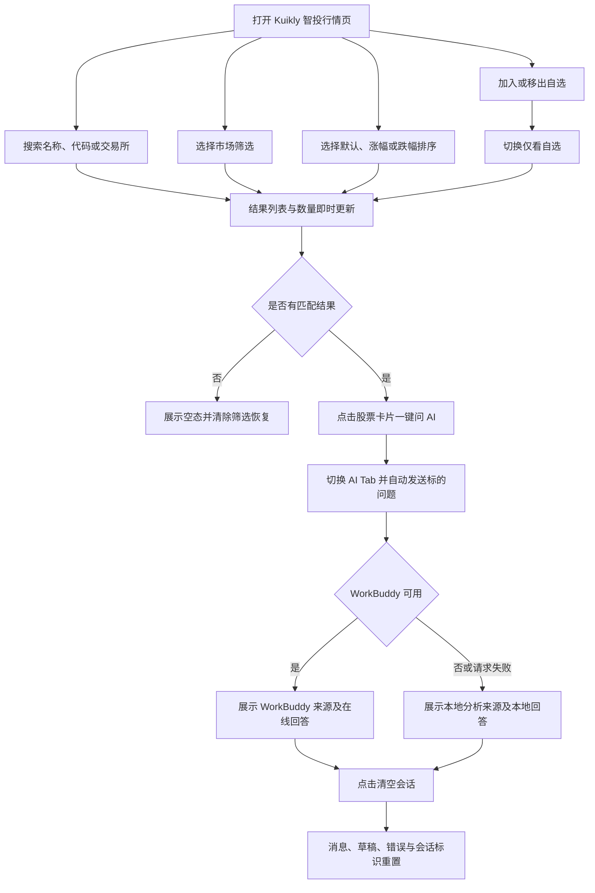

# 股票客户端功能与 AI 可用性增强 — GUI 测试执行计划

## 1. 需求概述

### 1.1 背景与目标

当前股票客户端行情页交互单一，默认未配置 WorkBuddy 时 AI 无法使用，且部分页面栅格、间距和信息对齐不统一。本次增强以 Android 端 Kuikly 智投为对象，在保持 Kuikly UI DSL、`DesignTokens` 与 WorkBuddy 凭证安全边界不变的前提下，增加行情发现、自选和快速 AI 能力，并使 AI 在默认安装下可通过本地分析正常工作。

本计划采用快速验收模式，聚焦本地差异直接影响的行情页、AI 投研页及二者之间的 P0 主链路，验证用户可见状态、故障降级和关键视觉对齐。

### 1.2 计划元信息

| 属性 | 值 |
|------|-----|
| 测试模式 | 快速验收-P0用例 |
| 目标平台 | android |
| 被测应用 | `com.ourcx.kuiklystock` |
| 应用安装状态 | 需要安装 |
| 需要构建 | 否 |
| 构建 Skill | 无 |
| 构建标识 | 无 |
| 涉及实验(AB) | 否 |
| 实验详情 | 无 |
| 需要测试数据 | 是 |
| 测试数据说明 | 使用应用内置的港股、A 股、美股确定性行情快照；分别准备未配置代理、合法 WorkBuddy 代理、代理请求失败三种 APK 或运行配置 |
| 工作目录 | `/ws/.flux/worker/86849345793569084/repos/ourcx/Kuikly-AI-/flux/changes/20260823-202156_enhance-features-ai/gui-test/` |
| 生成时间 | 2026-08-23 20:54:27 |

### 1.3 产品流程图

### 1.4 核心功能点

| # | 功能点 | 用户价值 / 测试目标 | 关键测试内容 |
|---|------|----------------|------------|
| 1 | 行情搜索、筛选与排序 | 快速定位目标市场和标的 | 即时搜索、Chip 选中态、排序方向、结果计数、组合条件 |
| 2 | 会话内自选与空态恢复 | 聚焦关注标的并从无结果状态恢复 | 加入/移出自选、仅看自选、会话内保持、清除筛选 |
| 3 | 一键问 AI | 缩短从行情发现到股票分析的路径 | 自动切换 AI Tab、自动发送对应问题、直接看到回答 |
| 4 | AI 双通道与来源透明 | 默认可用且不误导用户 | WorkBuddy 优先、未配置或失败时本地分析、来源标识、内容完整性 |
| 5 | 会话控制 | 让用户能重置上下文并避免重复提交 | 发送中防重、双失败重试、清空会话 |
| 6 | Kuikly 视觉与布局对齐 | 保持一致、清晰、可操作的暗色界面 | 设计色与层级、16px 边距、12px 卡片间距、价格列和操作基线 |

### 1.5 需求澄清

| 待澄清问题 | 用户回答 |
|------|---------|
| 无 | 需求规格、技术方案和设计规范足以生成快速验收计划；WorkBuddy 环境由后续执行阶段按测试数据说明准备 |

### 1.6 参考资料

| 文档链接 | 是否参考 | 原因 |
|----------|----------|------|
| `flux/changes/20260823-202156_enhance-features-ai/.reference/spec.md` | 是 | 功能要求、边界与验收标准的主要依据 |
| `flux/changes/20260823-202156_enhance-features-ai/.reference/proposal.md` | 是 | 明确用户目标、范围边界与能力定义 |
| `flux/changes/20260823-202156_enhance-features-ai/plan.md` | 是 | 明确用户可见状态流、降级策略与布局规则 |
| `/ws/.flux/worker/86849345793569084/artifacts/specs/design/DESIGN.md` | 是 | 用户指定的唯一视觉基准 |

---

## 2. 测试范围

| 类别 | 内容 |
|------|------|
| **测试范围内** | Android 行情页的搜索、市场筛选、排序、结果计数、自选、仅看自选、组合条件、无结果空态与恢复；行情卡片一键问 AI；AI 页 WorkBuddy 优先、本地降级、来源标识、发送防重、失败重试和清空会话；行情页与 AI 页关键布局和视觉对齐 |
| **测试范围外** | 账号、交易、实时行情、数据库、应用重启后或跨设备自选同步；股票详情新增能力；iOS/Harmony/Web；单元测试、接口测试、构建验证与 GitHub 推送；客户端内部凭证扫描（非 GUI 可观察项） |

---

## 3. 用户场景 & 测试分析

### User Story 1 — 组合发现目标行情

用户可在行情页通过搜索、市场筛选和排序组合缩小结果范围，并始终看到与当前列表一致的结果数量和清晰控制状态。

**原始素材路径**:

- `/ws/.flux/worker/86849345793569084/repos/ourcx/Kuikly-AI-/flux/changes/20260823-202156_enhance-features-ai/.reference/spec.md`
- `/ws/.flux/worker/86849345793569084/repos/ourcx/Kuikly-AI-/flux/changes/20260823-202156_enhance-features-ai/plan.md`

**验收标准**:

| # | Given | When | Then | 示意图（可选） | 优先级(P0/P1/P2) | 来源依据 |
|---|-------|------|------|----------------|-------------------|----------|
| 1 | 行情页已展示包含不同名称、代码与交易所的本地行情 | 在搜索框依次输入带首尾空格且大小写不同的股票名称、代码或交易所关键词 | 输入变化后列表立即过滤；首尾空格不影响结果；英文大小写不影响匹配；结果数量与可见卡片数一致 |  | P0 | `spec.md` 第5、20、31行；`plan.md` 第24-29行 |
| 2 | 行情页处于默认“全部”市场 | 依次点击港股、A 股、美股和全部 Chip | 每次仅展示对应市场或全部行情；当前 Chip 有清晰选中态；结果数量同步变化 |  | P0 | `spec.md` 第6、31行；`plan.md` 第15、24-29行 |
| 3 | 行情列表同时包含上涨与下跌标的 | 依次切换涨幅优先、跌幅优先和默认排序，并叠加一个搜索词与市场筛选 | 涨幅优先按涨跌幅从高到低，跌幅优先从低到高，默认恢复稳定原顺序；搜索、市场与排序同时生效，计数正确 |  | P0 | `spec.md` 第7、20-21、31行；`plan.md` 第15-17、24-29行 |

---

### User Story 2 — 管理自选并从空态恢复

用户可在当前应用会话内收藏关注股票、仅查看自选，并在组合条件导致无结果时通过明确入口恢复完整行情。

**原始素材路径**:

- `/ws/.flux/worker/86849345793569084/repos/ourcx/Kuikly-AI-/flux/changes/20260823-202156_enhance-features-ai/.reference/spec.md`
- `/ws/.flux/worker/86849345793569084/repos/ourcx/Kuikly-AI-/flux/changes/20260823-202156_enhance-features-ai/.reference/proposal.md`

**验收标准**:

| # | Given | When | Then | 示意图（可选） | 优先级(P0/P1/P2) | 来源依据 |
|---|-------|------|------|----------------|-------------------|----------|
| 4 | 行情页有多只股票且尚未退出应用会话 | 将一只股票加入自选，切换市场或排序后启用“仅看自选”，再移出该股票 | 自选状态在当前会话内保持；仅看自选只显示已收藏且满足其他条件的股票；移出后列表与结果数立即更新 |  | P0 | `spec.md` 第8、21、31行；`proposal.md` 第22、24行 |
| 5 | 当前没有自选，或搜索/市场/自选组合后无匹配股票 | 启用仅看自选，或输入无匹配关键词，或选择无匹配市场，再点击空态恢复入口 | 页面展示说明当前条件无结果的空态；恢复入口可见且可操作；点击后清除搜索、市场、排序和仅看自选条件并恢复完整行情，自选收藏本身保留 |  | P0 | `spec.md` 第13、21行；`plan.md` 第24-29行 |

---

### User Story 3 — 从行情卡片直接获得 AI 分析

用户可从任意股票卡片一键进入 AI 投研并直接看到该标的分析，无需手动重复输入。

**原始素材路径**:

- `/ws/.flux/worker/86849345793569084/repos/ourcx/Kuikly-AI-/flux/changes/20260823-202156_enhance-features-ai/.reference/spec.md`
- `/ws/.flux/worker/86849345793569084/repos/ourcx/Kuikly-AI-/flux/changes/20260823-202156_enhance-features-ai/plan.md`

**验收标准**:

| # | Given | When | Then | 示意图（可选） | 优先级(P0/P1/P2) | 来源依据 |
|---|-------|------|------|----------------|-------------------|----------|
| 6 | 行情页显示任意有效股票卡片，AI 当前未发送请求 | 点击该卡片的“一键问 AI” | 应用自动切换到 AI Tab，生成并发送包含该股票名称和代码的问题，随后直接展示该股票的分析回答 |  | P0 | `spec.md` 第9、32行；`proposal.md` 第23行；`plan.md` 第38-42行 |

---

### User Story 4 — 使用透明且可恢复的 AI 双通道

用户在默认安装和在线代理环境中都能提问，并能从页面准确识别回答来源；失败时仍获得明确可恢复反馈。

**原始素材路径**:

- `/ws/.flux/worker/86849345793569084/repos/ourcx/Kuikly-AI-/flux/changes/20260823-202156_enhance-features-ai/.reference/spec.md`
- `/ws/.flux/worker/86849345793569084/repos/ourcx/Kuikly-AI-/flux/changes/20260823-202156_enhance-features-ai/.reference/proposal.md`
- `/ws/.flux/worker/86849345793569084/repos/ourcx/Kuikly-AI-/flux/changes/20260823-202156_enhance-features-ai/plan.md`

**验收标准**:

| # | Given | When | Then | 示意图（可选） | 优先级(P0/P1/P2) | 来源依据 |
|---|-------|------|------|----------------|-------------------|----------|
| 7 | 分别安装未配置代理、配置合法代理、配置会失败代理的测试版本 | 在 AI 页输入有效股票问题并发送 | 未配置时返回本地分析并明确显示“本地分析”；合法代理时优先返回 WorkBuddy 结果并显示 WorkBuddy 来源；代理失败时只出现一次最终本地回答且显示本地来源，不伪装为在线服务 |  | P0 | `spec.md` 第10-11、22、29-30行；`proposal.md` 第21行；`plan.md` 第31-36行 |
| 8 | AI 页将通过本地通道回答有效股票问题 | 查看完整回答内容，并在发送期间再次点击发送；另在远端与本地分析均失败的配置下发送后点击重试 | 本地回答包含价格、涨跌、观察信息和非投资建议说明；发送中重复操作不会产生重复请求或重复消息；双失败时保留可重试失败消息，点击重试可再次发起 |  | P0 | `spec.md` 第22-23、25行 |
| 9 | AI 页已有消息、草稿或失败状态，且当前不在发送中 | 点击“清空会话” | 消息列表、草稿、错误和会话标识全部重置，页面回到可开始新会话的状态 |  | P0 | `spec.md` 第12、33行；`plan.md` 第9-10行 |

---

### User Story 5 — 检查关键界面视觉与栅格

用户在 Android 手机界面中获得统一的暗色视觉、清晰的控件层级和对齐稳定的行情卡片。

**原始素材路径**:

- `/ws/.flux/worker/86849345793569084/repos/ourcx/Kuikly-AI-/flux/changes/20260823-202156_enhance-features-ai/.reference/spec.md`
- `/ws/.flux/worker/86849345793569084/repos/ourcx/Kuikly-AI-/flux/changes/20260823-202156_enhance-features-ai/plan.md`
- `/ws/.flux/worker/86849345793569084/artifacts/specs/design/DESIGN.md`

**验收标准**:

| # | Given | When | Then | 示意图（可选） | 优先级(P0/P1/P2) | 来源依据 |
|---|-------|------|------|----------------|-------------------|----------|
| 10 | 行情页和 AI 页均已加载内容 | 浏览页头、搜索与筛选区、股票卡片、AI 输入区和底部导航，并对比多张行情卡片 | 页面保持深靛蓝暗色背景、清晰高对比文字与霓虹强调态；内容区只有一层约 16px 水平边距，卡片采用 16px 圆角、16px 内边距和 12px 垂直间距；名称/代码、固定右侧价格/涨跌、自选和 AI 操作处于统一栅格且标题与按钮基线一致，无明显溢出或错位 |  | P0 | `spec.md` 第14-15、34行；`proposal.md` 第26、58行；`plan.md` 第44-49行；`DESIGN.md` 第5-24、46-61、194-205行 |

---

## 4. 非功能性测试

### 4.1 兼容性

本需求明确当前实际启用和验证的平台为 Android；快速验收仅在 Android 上执行，不扩展到未要求的其他客户端。

| 客户端影响 | 是否影响 | 优先级(P0/P1/P2) |
|------------|----------|-------------------|
| Android | 是 | P0 |
| iOS | 否 | P2 |
| Harmony | 否 | P2 |
